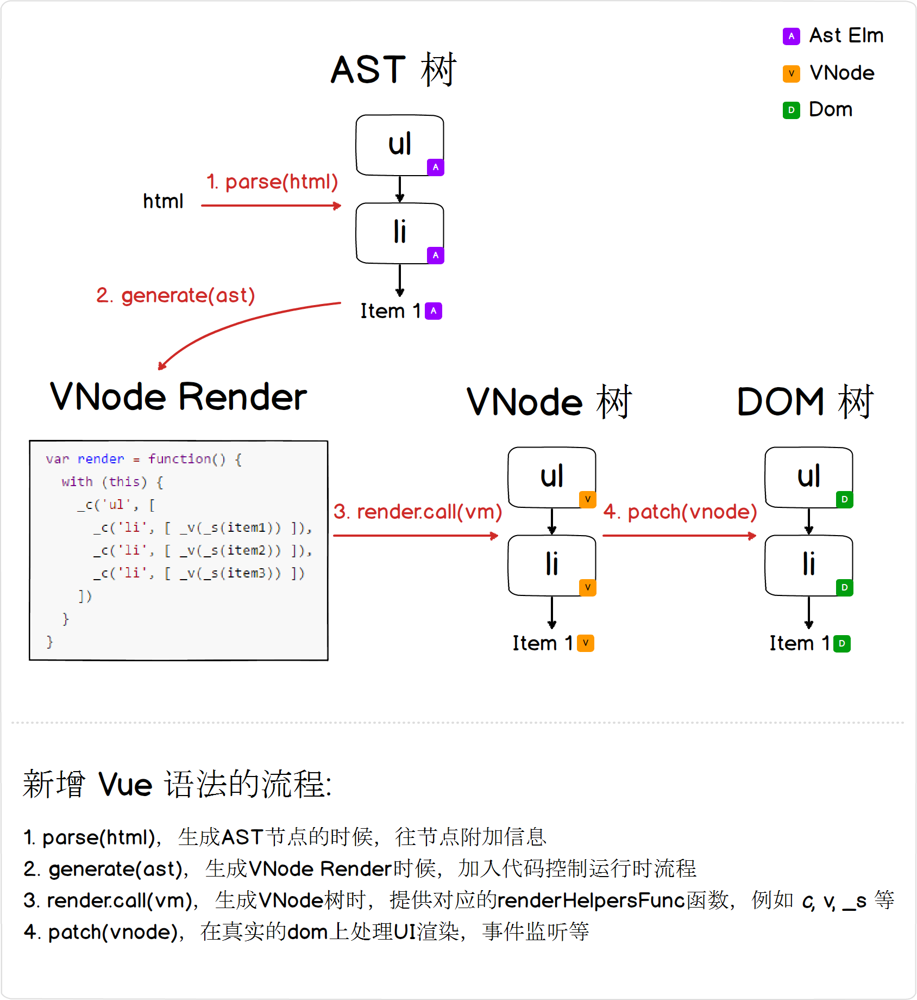

# 2.1 VNode 的属性 attrs 和 props

## 前言

在前边我们忽略了 Dom 元素的属性，我们这一节就把这个补齐。

[1.3 节](./1.3.md)说过新增语法的四个步骤：



a. 以下字符串:

```html
<input class="warn" value="default text" :style="innerStyle">
```

b. 解析后会得到 AST 节点:

```javascript
inputAstElm = {
  type: 1,
  tag: 'input',
  attrs: [
    { name: "class", value: "\"warn\"" },
    { name: "style", value: "innerStyle" }
  ],
  props: [ { name: "value", value: "\"default text\"" } ],
}
```

c. 再生成这样的render code:

```javascript
_c("input", {
  attrs: { "class": "warn", "style": innerStyle },
  domProps: { "value": "default text" }
}, [])
```

d. 得到一个带属性的 VNode 节点:

```javascript
VNode {
  tag: 'input',
  data: {
    attrs: { "class": "warn", "style": "vm.innerStyle运行后的值" },
    domProps: { "value": "default text" },
  }
}
```

e. 最后渲染在 dom 上的时候:

```javascript
inputDom.setAttribute("class", "warn")
inputDom.setAttribute("style", "vm.innerStyle运行后的值")
inputDom.value = "default text"
```

综上述：首先，我们需要给 VNode 类加多一个 data 成员，以后 VNode 上的各类信息会记录在 data 成员上，例如 attrs 和 domProps 都是记录在 data 上的。

```javascript
// core/vdom/vnode.js
export default class VNode {
  constructor (
    tag,      // 标签名
    data,     // data = { attrs: 属性key-val }
    children, // 孩子 [VNode, VNode]
    text,     // 文本节点
    elm       // 对应的真实dom对象
  ) {
    this.tag = tag
    this.data = data
    this.children = children
    this.text = text
    this.elm = elm
  }
}
```

然后我们按照上图提到的四个步骤开始改造代码。

## 1. AST 节点附带 attrs 和 props 信息

处理 StartToken 的时候加入属性的处理：

```javascript
// compiler/parser/index.js
export function parse (template) {
  // blabla..
  parseHTML(template, {
    warn,
    start (tag, attrs, unary) {
      const element = {
        type: 1,
        tag,
        attrsList: attrs,
        attrsMap: makeAttrsMap(attrs),
        parent: currentParent,
        children: []
      }

      // 处理节点的属性
      processAttrs(element)

      // blabla..
    },
    end () {},
    chars (text) {},
  }
  return root
}
```

属性同时支持静态字符串或者动态绑定数据，动态绑定的语法是 (v-bind和一个冒号是等价的[见官方文档](https://cn.vuejs.org/v2/guide/syntax.html#v-bind-缩写)):

 ```<input v-bind:value="value">``` 或 ```<input :value="value">```

其中 vm.sameValue 最后会渲染 input 元素的 value 值里边。

```javascript
// compiler/parser/index.js
export const dirRE = /^v-|^:/
const bindRE = /^:|^v-bind:/

function processAttrs (el) {
  const list = el.attrsList
  let i, l, name, value
  for (i = 0, l = list.length; i < l; i++) {
    name  = list[i].name
    value = list[i].value

    if (dirRE.test(name)) {
      // mark element as dynamic
      el.hasBindings = true

      if (bindRE.test(name)) { // :xxx 或者 v-bind:xxx
        name = name.replace(bindRE, '')

        if (mustUseProp(el.tag, el.attrsMap.type, name)) {
          addProp(el, name, value)
        } else {
          addAttr(el, name, value)
        }
      }
    } else {
      // 静态字符串
      addAttr(el, name, JSON.stringify(value))
    }
  }
}

function addProp (el, name, value) {
  (el.props || (el.props = [])).push({ name, value })
}

function addAttr (el, name, value) {
  (el.attrs || (el.attrs = [])).push({ name, value })
}
```

## 2. 生成 VNode render 时加入属性参数

改造一下 ```genElement```，加入处理属性的流程：

```javascript
// compiler/codegen/index.js
function genElement (el){
  let code
  const children = genChildren(el)
  const data = genData(el)

  code = `_c('${el.tag}'${
      `,${data}` // data
    }${
    children ? `,${children}` : '' // children
  })`

  return code
}

function genData (el) {
  let data = '{'

  if (el.attrs) {
    data += `attrs:{${genProps(el.attrs)}},`
  }
  // DOM props
  if (el.props) {
    data += `domProps:{${genProps(el.props)}},`
  }

  data = data.replace(/,$/, '') + '}'

  return data
}


function genProps (props) {
  let res = ''
  for (let i = 0; i < props.length; i++) {
    const prop = props[i]
    res += `"${prop.name}":${prop.value},`
  }
  return res.slice(0, -1) // 去掉尾巴的逗号
}
```

## 3. 提供运行时的 renderHelpersFunc

改造一下 ```_c``` 方法，支持传递 data 属性，创建一个带 data 成员的 VNode：

```javascript
// core/vdom/vnode.js
export function createElementVNode(tag, data, children) {
  if (!tag) {
    return createEmptyVNode()
  }

  let vnode = new VNode(tag, data, children, undefined, undefined)
  return vnode
}

// core/instance/index.js
Vue.prototype._c = createElementVNode
```

## 4. 在渲染 Dom 树时把属性 set 进节点

在patch 的两个流程，我们需要加入属性处理：

1. createElm(vnode) 创建 Dom 节点的时候

   ```javascript
   // core/vdom/patch.js
   function createElm (vnode, parentElm, refElm) {
     const children = vnode.children
     const tag = vnode.tag
     if (isDef(tag)) {
       vnode.elm = nodeOps.createElement(tag)

       createChildren(vnode, children)

       // 添加属性
       updateAttrs(emptyNode, vnode)
       updateDOMProps(emptyNode, vnode)

       insert(parentElm, vnode.elm, refElm)
     } else {
       // 文本节点 blabla..
     }
   }
   ```

2. patchVnode(oldVnode, vnode) update 旧 Dom 节点的时候

   ```javascript
   // core/vdom/patch.js
   function patchVnode (oldVnode, vnode) {
     // blabla..

     const hasData = isDef(data)

     // 更新属性
     if (hasData) {
       updateAttrs(oldVnode, vnode)
       updateDOMProps(oldVnode, vnode)
     }

     // blabla..
   }
   ```

更新一个 Dom 的 attrs:

```javascript
// core/vdom/attrs.js
export function updateAttrs (oldVnode, vnode) {
  if (!oldVnode.data.attrs && !vnode.data.attrs) {
    return
  }
  let key, cur, old
  const elm = vnode.elm
  const oldAttrs = oldVnode.data.attrs || {}
  let attrs= vnode.data.attrs || {}

  for (key in attrs) {
    cur = attrs[key]
    old = oldAttrs[key]
    if (old !== cur) { // 如果旧属性的值和当前值不一致
      // set到当前dom里边去
      setAttr(elm, key, cur)
    }
  }

  for (key in oldAttrs) {
    if (attrs[key] == null) { // 删除旧属性
      elm.removeAttribute(key)
    }
  }
}
```

更新一个 Dom 的 props:

```javascript
// core/vdom/dom-props.js
export function updateDOMProps (oldVnode, vnode) {
  if (!oldVnode.data.domProps && !vnode.data.domProps) {
    return
  }
  let key, cur
  const elm = vnode.elm
  const oldProps = oldVnode.data.domProps || {}

  let props = vnode.data.domProps || {}

  // 删除旧props
  for (key in oldProps) {
    if (props[key] == null) {
      elm[key] = ''
    }
  }

  // 添加旧props
  for (key in props) {
    elm[key] = props[key]
  }
}
```

## 代码整理

在这个分支开始，我们会逐步新增各种语法糖，逐步搭建 Vue-todo 的案例。

用 Chrome 打开 examples/2.1/todo/index.html，然后在控制台输入：

```javascript
app.setData({
      todos: todoStorage.fetch(),
      newTodo: 'new input',
      editedTodo: null,
      visibility: 'active'
})
```

你会看到 文本框的内容变成了 "new input"，底下的 Tab "Active" 被选中。